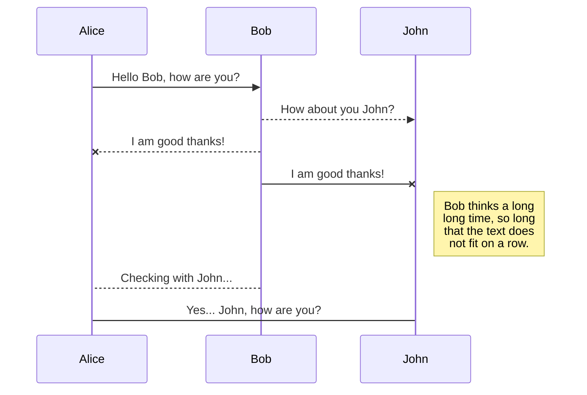
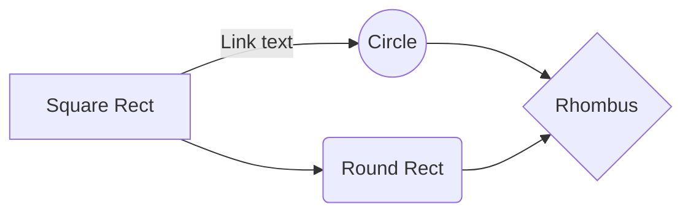

# PIO ESP-IDF Project Documentation

Here is some documentation to make a PIO project from scratch using the ESP-IDF framework on MacOS. This is just a place where I put all the commands for easy access. 

# Creating Virtual Env on MacOSX

Since PlatformIO isn't best suited for MacOS, first create a virtual environment based on Intel architecture for Rosetta compatibility

    arch -x86_64 /usr/bin/python3 -m venv ~/platformio-intel
    source ~/platformio-intel/bin/activate
  
 Finish setting up the environment by installing some necessary modules

    pip install --upgrade pip setuptools wheel
    pip install platformio
  
  Finally check to see if the desired platformio version was downloaded:
  

    pio --version

## Create and Run a New Project

Here is the command to create a new ESP-IDF project

    platformio project init --board esp32dev --project-option="framework=espidf"
Now, the project is complete. In order to make a file for the ESP32 microcontroller make a file like `src/*.c` and use to following commands to upload the code to ESP32:

    >>> pio run -t clean
    >>> pio run
    >>> pio run -t upload
   
   If any settings such as Bluetooth settings need to be activated, run the following command to see the menu:

    pio run -t menuconfig
   
   In order to see the serial data incoming from the ESP32, use the following command:

    pio device monitor --rts 0 --dtr 0 --baud [baud rate]

By default, the baud rate should usually be 115200.

# How is This Supposed to Work?

## GAP Layer

GAP stands for Generic Access Profile. Think of GATT/ATT as a postal service that ships packets after you have the address. GAP is sort of the town notice board and handshake protocol that that lets two strangers discover, identify, and agree to talk. The following are the jobs of the GAP Protocol:
| GAP JOB | Descrition | Details |
|--|--|--|
| Advertising | Advertises the name of the device and the service | Small broadcast packets sent at every adv interval. The contents are the [flags, device name, service UUID list, etc.] |
| Scanning | Listens for device and service of interest | A central device scans, goes through each advertisement and decides whom to approach |
| Establishing Link | Sends a connection request | Central sends a CONNECTION_REQ, and advertiser becomes a peripheral |
| Exchanging Connection Parameters | Sends details of the connection | Min/Max interval, latency, supervision-timeout |
| Security Pairing/Bonding| Swapping Keys/PWDs | Just-Works, Passkeys, Numeric Compare -- Handles by GAP before GATT is allowed to send encrypted data |
| Role Management | Deciding who is the caller vs reader | Device can be Central, Peripheral, Observer, Broadcaster, or multiple at once

Once these steps are done, the ATT/GATT takes over to read, write, and notify the actual characteristic values.

## Rename a file

You can rename the current file by clicking the file name in the navigation bar or by clicking the **Rename** button in the file explorer.

## Delete a file

You can delete the current file by clicking the **Remove** button in the file explorer. The file will be moved into the **Trash** folder and automatically deleted after 7 days of inactivity.

## Export a file

You can export the current file by clicking **Export to disk** in the menu. You can choose to export the file as plain Markdown, as HTML using a Handlebars template or as a PDF.

# Synchronization

Synchronization is one of the biggest features of StackEdit. It enables you to synchronize any file in your workspace with other files stored in your **Google Drive**, your **Dropbox** and your **GitHub** accounts. This allows you to keep writing on other devices, collaborate with people you share the file with, integrate easily into your workflow... The synchronization mechanism takes place every minute in the background, downloading, merging, and uploading file modifications.

There are two types of synchronization and they can complement each other:

- The workspace synchronization will sync all your files, folders and settings automatically. This will allow you to fetch your workspace on any other device.
	> To start syncing your workspace, just sign in with Google in the menu.

- The file synchronization will keep one file of the workspace synced with one or multiple files in **Google Drive**, **Dropbox** or **GitHub**.
	> Before starting to sync files, you must link an account in the **Synchronize** sub-menu.

## Open a file

You can open a file from **Google Drive**, **Dropbox** or **GitHub** by opening the **Synchronize** sub-menu and clicking **Open from**. Once opened in the workspace, any modification in the file will be automatically synced.

## Save a file

You can save any file of the workspace to **Google Drive**, **Dropbox** or **GitHub** by opening the **Synchronize** sub-menu and clicking **Save on**. Even if a file in the workspace is already synced, you can save it to another location. StackEdit can sync one file with multiple locations and accounts.

## Synchronize a file

Once your file is linked to a synchronized location, StackEdit will periodically synchronize it by downloading/uploading any modification. A merge will be performed if necessary and conflicts will be resolved.

If you just have modified your file and you want to force syncing, click the **Synchronize now** button in the navigation bar.

> **Note:** The **Synchronize now** button is disabled if you have no file to synchronize.

## Manage file synchronization

Since one file can be synced with multiple locations, you can list and manage synchronized locations by clicking **File synchronization** in the **Synchronize** sub-menu. This allows you to list and remove synchronized locations that are linked to your file.

# Publication

Publishing in StackEdit makes it simple for you to publish online your files. Once you're happy with a file, you can publish it to different hosting platforms like **Blogger**, **Dropbox**, **Gist**, **GitHub**, **Google Drive**, **WordPress** and **Zendesk**. With [Handlebars templates](http://handlebarsjs.com/), you have full control over what you export.

> Before starting to publish, you must link an account in the **Publish** sub-menu.

## Publish a File

You can publish your file by opening the **Publish** sub-menu and by clicking **Publish to**. For some locations, you can choose between the following formats:

- Markdown: publish the Markdown text on a website that can interpret it (**GitHub** for instance),
- HTML: publish the file converted to HTML via a Handlebars template (on a blog for example).

## Update a publication

After publishing, StackEdit keeps your file linked to that publication which makes it easy for you to re-publish it. Once you have modified your file and you want to update your publication, click on the **Publish now** button in the navigation bar.

> **Note:** The **Publish now** button is disabled if your file has not been published yet.

## Manage file publication

Since one file can be published to multiple locations, you can list and manage publish locations by clicking **File publication** in the **Publish** sub-menu. This allows you to list and remove publication locations that are linked to your file.

# Markdown extensions

StackEdit extends the standard Markdown syntax by adding extra **Markdown extensions**, providing you with some nice features.

> **ProTip:** You can disable any **Markdown extension** in the **File properties** dialog.

## SmartyPants

SmartyPants converts ASCII punctuation characters into "smart" typographic punctuation HTML entities. For example:

|                |ASCII                          |HTML                         |
|----------------|-------------------------------|-----------------------------|
|Single backticks|`'Isn't this fun?'`            |'Isn't this fun?'            |
|Quotes          |`"Isn't this fun?"`            |"Isn't this fun?"            |
|Dashes          |`-- is en-dash, --- is em-dash`|-- is en-dash, --- is em-dash|

## KaTeX

You can render LaTeX mathematical expressions using [KaTeX](https://khan.github.io/KaTeX/):

The *Gamma function* satisfying $\Gamma(n) = (n-1)!\quad\forall n\in\mathbb N$ is via the Euler integral

$$
\Gamma(z) = \int_0^\infty t^{z-1}e^{-t}dt\,.
$$

> You can find more information about **LaTeX** mathematical expressions [here](http://meta.math.stackexchange.com/questions/5020/mathjax-basic-tutorial-and-quick-reference).

## UML diagrams

You can render UML diagrams using [Mermaid](https://mermaidjs.github.io/). For example, this will produce a sequence diagram:

And this will produce a flow chart:

